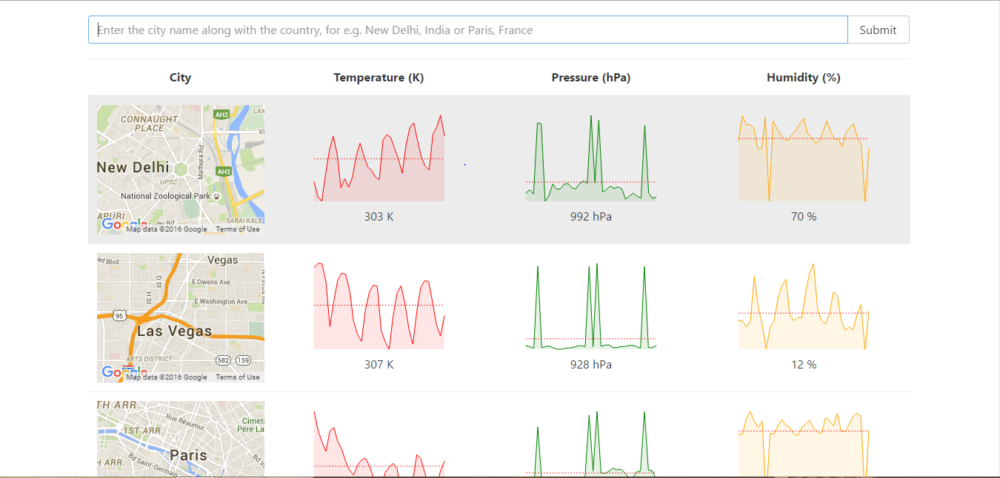

# weather_app



To test this or use this, execute the following commands on the terminal:

```
git clone https://github.com/DeveshAgrawal1/weather_app.git
cd weather_app
npm install
npm start
```

Then, go to http://localhost:8080 on your browser.
